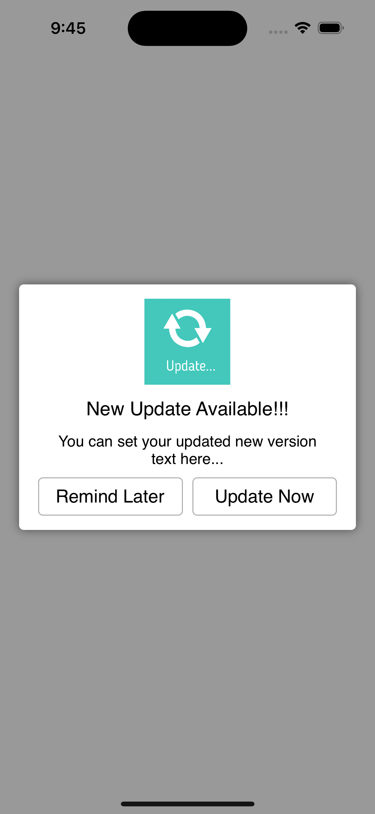
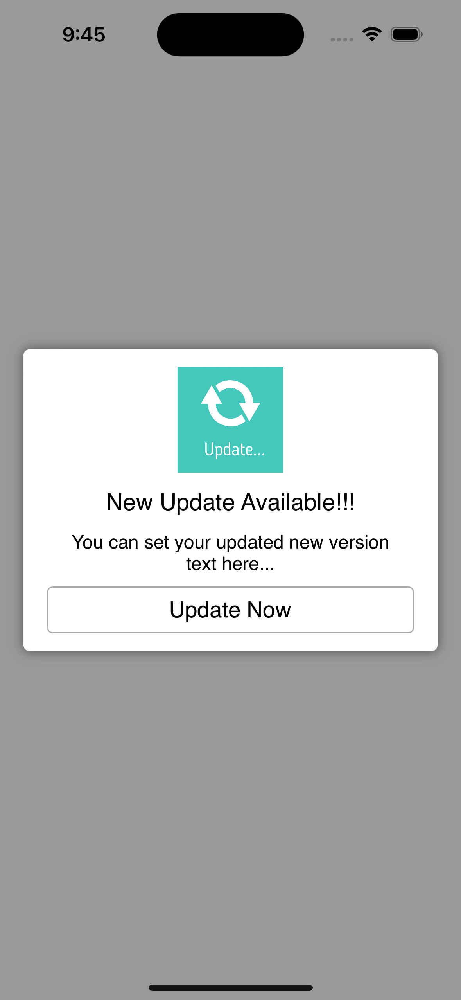

# ManageUpdate-iOS

<h1>Introduction</h1>
Here I am presenting an interesting Custom Manage Update App Control to integrate inside your native iOS-based application. 
ManageUpdate is a simple component, which lets you force update your app with new version live on apple store. 

<br/><br/>
<h1>Features</h1>

- Manage update app on apple store.
- You can customze the layout, title and description of the new version.
- You can set the minimum version for the update and set the force updating the app.
- Fully customizable layout.

<div style="float:left">


</div>


<br/><br/>
<h1>Getting Started</h1>

To use this component in your project you need to perform the below steps:

> Steps to Integrate


1) Add `ManageUpdateVC.swift` and `ManageUpdateVC.xib` at the required place on your code.

2) Add below code where you want to Integrate Manage update feature in the controller:

*You have to add `getUpdatedVersion()` function in you AppDelegate or in AppUtitlity Class.
This function will have API call where you can get the latest version of the live app. 
Now compare the live version with Lcoal version of the app. 

3) If you get diffrenent verision or heigher version you can call the 
`func getUpdateWithDict(dictData : NSDictionary)` function to show the Manageupdate dialog. 

* Add getUpdateWithDict function:
```
    func getUpdateWithDict(dictData : NSDictionary)  {
        ManageUpdateVC.showPopup(strTitle: "New Update Available!!!", dictData: dictData,viewController: self, completion: { (sender) -> Void in
            print("\(sender.tag)")
            if sender.tag == 101 {
                if let url = URL(string: ""), UIApplication.shared.canOpenURL(url) {
                    if #available(iOS 10.0, *) {
                        //This will open the app store in the app with iTunes App URL.
                        UIApplication.shared.open(url, options: [:], completionHandler: nil)
                    } 
                    else {
                        //Fallback on earlier versions
                        UIApplication.shared.openURL(url)
                    }
                }
            }
            else {
                //Close Popup login
            }
        })
    }
```

**Note:** Make sure that the extension which is used in this component has been added to your project. 


<br/><br/>
**<h1>Bugs and Feedback</h1>**
For bugs, questions and discussions please use the Github Issues.


<br/><br/>
**<h1>License</h1>**
The MIT License (MIT)
<br/><br/>
Copyright (c) 2020 Bharat
<br/><br/>
Permission is hereby granted, free of charge, to any person obtaining a copy of this software and associated documentation files (the "Software"), to deal in the Software without restriction, including without limitation the rights to use, copy, modify, merge, publish, distribute, sublicense, and/or sell copies of the Software, and to permit persons to whom the Software is furnished to do so, subject to the following conditions: 
<br/><br/>
THE SOFTWARE IS PROVIDED "AS IS", WITHOUT WARRANTY OF ANY KIND, EXPRESS OR IMPLIED, INCLUDING BUT NOT LIMITED TO THE WARRANTIES OF MERCHANTABILITY, FITNESS FOR A PARTICULAR PURPOSE AND NONINFRINGEMENT. IN NO EVENT SHALL THE AUTHORS OR COPYRIGHT HOLDERS BE LIABLE FOR ANY CLAIM, DAMAGES OR OTHER LIABILITY, WHETHER IN AN ACTION OF CONTRACT, TORT OR OTHERWISE, ARISING FROM, OUT OF OR IN CONNECTION WITH THE SOFTWARE OR THE USE OR OTHER DEALINGS IN THE SOFTWARE.

<br/>
<h1></h1>


